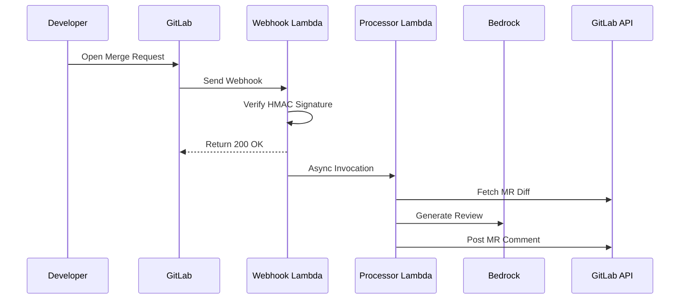

<div align="center">


<br/><br/>

# 🤖 ReviewFlow

### Secure Multi-Agent AI Merge Request Review Pipeline

**Async AI-powered GitLab MR reviews using AWS Lambda, LangGraph, and Amazon Bedrock**

</div>

---

# 📌 Overview

ReviewFlow is a secure asynchronous AI-powered Merge Request review system that automatically analyzes GitLab Merge Requests and posts structured AI-generated review comments.

The platform combines:

- AWS Lambda
- Amazon Bedrock
- LangGraph multi-agent orchestration
- GitLab Webhooks
- Event-driven serverless architecture

to provide intelligent automated code reviews for:

- 🔒 Security vulnerabilities
- 🧹 Code quality issues
- 🐛 Potential bugs

---

# 🧩 Problem Statement

Modern development teams face several challenges during code reviews:

- Merge Request reviews are time-consuming and delay deployments
- Review quality varies across reviewers
- Security vulnerabilities often go unnoticed
- Large teams create reviewer bottlenecks
- Manual reviews are difficult to scale consistently

Traditional review workflows are not optimized for speed, scalability, or intelligent automated analysis.

---


# 🎯 Solution

ReviewFlow provides a secure multi-agent AI review pipeline that automatically analyzes Merge Requests in near real-time.

The system:

- Receives GitLab MR webhook events
- Verifies webhook authenticity using HMAC signatures
- Uses asynchronous Lambda execution for scalability
- Fetches MR diffs automatically
- Runs specialized LangGraph AI agents
- Generates structured review comments
- Posts feedback directly back onto the Merge Request

---

# 🔄 Sequence Flow



---

# 🏗️ Architecture

## High-Level Architecture

```mermaid
flowchart LR

    A[Developer Opens Merge Request] --> B[GitLab Merge Request Event]

    B --> C[GitLab Webhook]

    C --> D[Lambda A - Webhook Handler]

    D --> E[Verify HMAC Signature]

    E --> F{Valid Request?}

    F -->|No| G[Return 403 Unauthorized]

    F -->|Yes| H[Return HTTP 200 Immediately]

    H --> I[Async Invoke Processor Lambda]

    I --> J[Lambda B - MR Processor]

    J --> K[Fetch MR Diff via GitLab API]

    K --> L[Gitleaks Secret Scan]

    L --> M[Mask Sensitive Secrets]

    M --> N[LangGraph Orchestrator]

    N --> O[Security Agent]

    N --> P[Code Quality Agent]

    N --> Q[Bug Detection Agent]

    O --> R[Aggregate Findings]
    P --> R
    Q --> R

    R --> S[Amazon Bedrock LLM]

    S --> T[Structured Review Generation]

    T --> U[Post MR Comment to GitLab]

    U --> V[Review Completed Under 2 Minutes]
```



---

## Gitlab Comment Screenshot on MR


---

# 🤖 AI Pipeline

ReviewFlow uses LangGraph StateGraph orchestration to coordinate multiple specialized AI review agents.

## 🔒 Security Agent

Analyzes:
- Hardcoded secrets
- Injection risks
- Broken authentication
- Unsafe configurations

---

## 🧹 Code Quality Agent

Analyzes:
- Poor naming conventions
- Complexity issues
- Code duplication
- Missing error handling

---

## 🐛 Bug Detection Agent

Analyzes:
- Null pointer risks
- Unhandled exceptions
- Edge cases
- Logical bugs
- Race conditions

---

# 🧠 LangGraph Orchestration

The review workflow is implemented using LangGraph multi-agent orchestration.

```text
Security Agent
        ↓
Quality Agent
        ↓
Bug Agent
        ↓
Aggregator
        ↓
Structured MR Review
```

---

# 🔐 Security Features

## HMAC Webhook Verification

The public Lambda Function URL is protected using GitLab webhook signing tokens and HMAC SHA256 verification.

### Features

- Request authenticity validation
- Payload integrity verification
- Replay attack resistance
- Constant-time signature comparison

---

## Function URL Security Model

ReviewFlow uses:

- AWS Lambda Function URLs
- Public ingress endpoint
- Cryptographic webhook verification
- Internal asynchronous Lambda invocation

The processor Lambda is NOT publicly exposed.

---

## Planned Security Enhancements

- Gitleaks integration before LLM inference
- Secret masking pipeline
- API Gateway + AWS WAF support
- SQS buffering architecture
- Replay protection persistence

---

# ☁️ AWS Architecture

## Services Used

| Service | Role |
|---|---|
| AWS Lambda | Serverless webhook and processing pipeline |
| Amazon Bedrock | LLM inference |
| LangGraph | Multi-agent orchestration |
| GitLab Webhooks | Event source |
| CloudWatch | Logging and observability |
| Lambda Function URLs | Public webhook ingress |

---

# ⚡ Asynchronous Event-Driven Design

ReviewFlow uses two Lambda functions to decouple webhook ingestion from heavy AI processing.

## Lambda A — Webhook Handler

Responsibilities:

- Receive GitLab webhook
- Verify HMAC signature
- Return HTTP 200 immediately
- Trigger processor Lambda asynchronously

---

## Lambda B — MR Processor

Responsibilities:

- Fetch MR diffs
- Run LangGraph workflow
- Call Bedrock LLM
- Post MR comments

---

## Benefits

- Improved scalability
- Faster webhook acknowledgement
- Better fault isolation
- Independent AI processing
- Horizontal scaling support

---


# ⚙️ Environment Variables

## Webhook Lambda

```env
WEBHOOK_SIGNING_SECRET=
```

---

## Processor Lambda

```env
GITLAB_TOKEN=
GITLAB_URL=
AWS_REGION=us-east-1
```

---

# 🚀 Setup

## Install Dependencies

```bash
pip install -r requirements.txt
```

---

## Configure GitLab Webhook

Enable:

- Merge Request Events

Configure:

- Webhook URL
- Signing Token

---

## Deploy Lambda Functions

Deploy:

- Webhook Handler Lambda
- MR Processor Lambda

---

# 🧪 Example Review Output

```text
ISSUE: Hardcoded API key detected
SEVERITY: High
FILE: auth.py
LINE: 42
SUGGESTION: Move secret to environment variables
```

---

# 🛣️ Roadmap

- Gitleaks secret scanning
- ChromaDB RAG pipeline
- GitHub support
- Inline review comments
- Claude Sonnet integration
- SQS architecture
- API Gateway + WAF
- Repository context retrieval

---

# 📈 Future Enhancements

Future versions will support repository-aware contextual analysis using:

- Retrieval Augmented Generation (RAG)
- ChromaDB vector search
- Semantic code retrieval
- Repository-aware AI review context

---

# 🛡️ Important Notes

Do NOT commit:

- GitLab tokens
- AWS credentials
- Webhook secrets
- `.env` files

---

## 📋 Contributing

This project is open to contributions — if you have an idea to improve it, a bug to fix, or a feature to add, feel free to fork the repo, make your changes and open a pull request. All contributions are welcome, no matter how small.

If you use this on your profile, consider giving it a ⭐ — it helps others find it.

---

*Let's build together — fork it, break it, improve it.*

---
<div align="center">
  
**Built with ❤️ and lots of ☕ by Mayank Singh**

</div>
